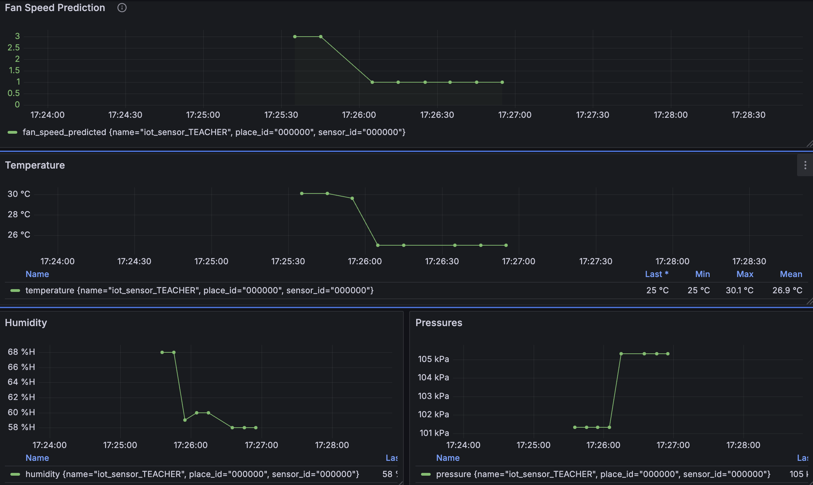

# Online Prediction

<!-- Online Prection ทำงานอย่างไร  -->

## ปิดการใช้งานของ Batch ML ดังนี้

1. a kafka to json  
2. b predict-then-influxdb
3. c train-from-data

## เริ่มใช้งาน Online ML ดังนี้

1. docker compose down online ml
2. แก้ env ของ online ml
3. docker compose up online ml

## ผลที่ได้จากการใช้ ML มีดังนี้

<!-- แนบรูป Grafana  พร้อมอธิบาย -->
